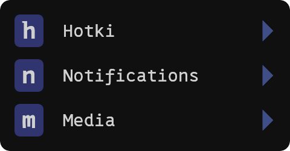
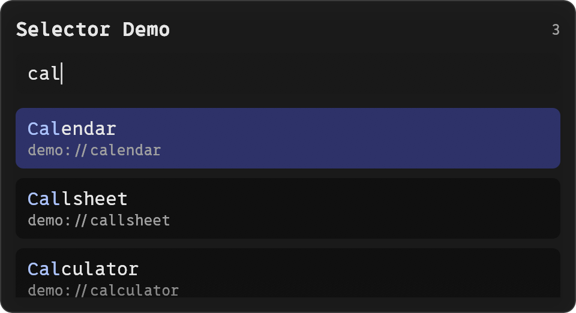

# Hotki

Hotki is a macOS-only hotkey application configured with Luau.

Behavior lives at `~/.hotki/config.luau`. Styling lives in optional sibling
`~/.hotki/style.luau`, which overlays Hotki's embedded default style.

Features:

- Global hotkeys and nested HUD menus.
- Luau config with typed API docs.
- App and custom-item selectors.
- Shell, open, relay, media, and volume actions.
- Native notifications and style overlays.

```bash
hotki check --config ~/.hotki/config.luau
hotki style --default
hotki api
hotki api --surface config --filter Actions
hotki api --surface style
hotki api --surface all --markdown
```

`cargo xtask install` installs `Hotki.app` to `/Applications` and links the
embedded CLI at `~/.local/bin/hotki`.

## Screenshots

Generated from Hotki's embedded default style with `cargo xtask screenshots`.

### HUD



### Selector



### Notifications


Docs:

- [CONFIG.md](./CONFIG.md): Luau config structure, selectors, and validation.
- [STYLE.md](./STYLE.md): `style.luau`, the embedded default style, and style dumping.
- [examples/](./examples/): example configs and style overlays.

Minimal `config.luau`:

<!-- hotki-luau: config -->
```luau
local a = hotki.actions
local GLOBAL = { global = true, hidden = true }

return function(menu, ctx)
    if ctx.hud then
        menu:bind("esc", "Back", a.pop, GLOBAL)
    end

    menu:submenu("shift+cmd+0", "Main", function(root)
        root:bind("r", "Reload", a.reload_config)
        root:bind("a", "Run Application", a.select({
            items = hotki.applications,
            on_select = function(select_ctx, item)
                select_ctx:open(item.data.path)
            end,
        }))
    end, { capture = true })
end
```
