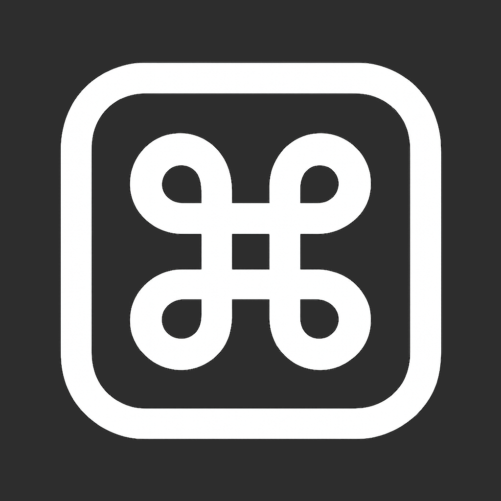
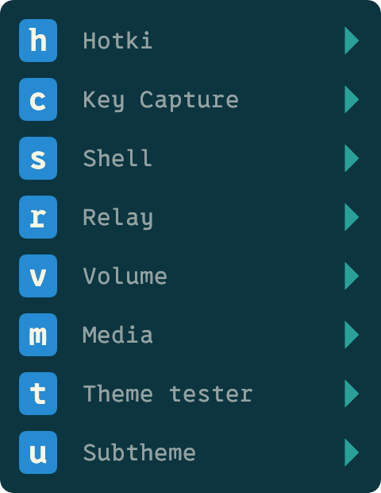

[](https://opensource.org/licenses/MIT)

<p align="center">
  
</p>

# Hotki

A modal hotkey app for macOS.

- Modal hotkeys for macOS
- A customizable HUD (Heads-Up Display) for displaying active mode hotkeys
- Customizable notifications to display hotkey action outcomes
- Hotkeys for any app with key relaying and focus matching

Hotki is now an early alpha - it's stable and my daily driver, but I'm not
cutting binary releases yet. See the [Installation](#installation) section
below for how to build it. Next steps:

- External window-management CLI (Hotki will call it via `shell(...)` bindings)
- More sophisticated HUD patterns allowing text entry, selection, etc.
- Window groups


## Window State Architecture

Hotki relies on the `hotki-world` crate for read-only focus and display
snapshots. Engines, smoketests, and auxiliary tooling subscribe to the
[`WorldView`](crates/hotki-world/src/view.rs) trait instead of calling
platform APIs directly. This keeps macOS-specific reads in one place and
simplifies testing via the in-memory `TestWorld`.

Display geometry (active display bounds and the `global_top` conversion helper)
also flows through `WorldView::displays()` / `WorldHandle::displays_snapshot()`.
UI components and smoketests should use these helpers rather than invoking
platform APIs directly. All window mutation now happens out-of-process via an
external CLI invoked through `shell(...)` bindings.

## Contributor Docs

- [Testing Principles](docs/testing-principles.md) – relay + HUD guidance, budgets, skip semantics,
  message style, and "Do Not Do" guidance.


## Configuration

Hotki configuration lives at `~/.hotki/config.rhai` and is written in Rhai.

- Full DSL reference: `docs/rhai-config.md`
- Examples: `examples/complete.rhai`, `examples/phase2_actions.rhai`, `examples/match.rhai`

Validate a config without starting the UI:

```bash
hotki check --config ~/.hotki/config.rhai
hotki check  # uses the default resolution policy
```

Minimal example:

```rhai
base_theme("default");

style(#{
  hud: #{
    pos: ne,
    mode: hud_full,
  },
});

global.mode("shift+cmd+0", "Main", |m| {
  m.bind("s", "Save", relay("cmd+s")).no_exit();
  m.bind("n", "Next Theme", theme_next);
  m.bind("p", "Previous Theme", theme_prev);
});

global.bind("esc", "Back", pop).global().hidden().hud_only();
```

## Themes and Styling

Every aspect of Hotki's UI is customizable. We have a few built-in
[themes](./crates/config/themes) that you can build on, or you can override
everything for complete control.


<table>
  <tr>
    <td> 
        <center><b>default</b></center>
        
    </td>
    <td> 
        
        
        
        
    </td>
  </tr>
  <tr></tr>
  <tr>
    <td> 
        <center><b>solarized-dark</b></center>
        
    </td>
    <td> 
        
        
        
        
    </td>
  </tr>
  <tr></tr>
  <tr>
    <td>
        <center><b>solarized-light</b></center>
        
    </td>
    <td> 
        
        
        
        
    </td>
  </tr>
  <tr></tr>
  <tr>
    <td>
        <center><b>dark-blue</b></center>
        
    </td>
    <td> 
        
        
        
        
    </td>
  </tr>
  <tr></tr>
  <tr>
    <td>
        <center><b>charcoal</b></center>
        
    </td>
    <td> 
        
        
        
        
    </td>
  </tr>
</table>


## Fonts

The default bundled font is a [Nerd Font](https://www.nerdfonts.com/)
([0xProto](https://github.com/0xType/0xProto)
Nerd Font Mono). Nerd Fonts include a wide range of glyphs and symbols used
throughout the UI, and which can be used in styling.


# Installation

We don't have binary releases yet. For the moment, the installation process is
to compile the app bundle using the following script from the repo root:

```sh
./scripts/bundle.sh
```

The bundle will be at `./target/bundle/Hotki.app`, ready to copy to your
`/Applications` folder.
