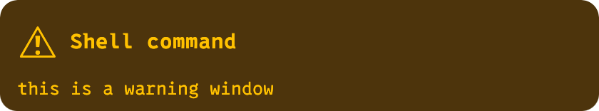
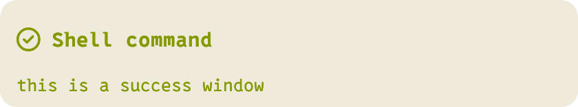

[](https://opensource.org/licenses/MIT)

<p align="center">
  
</p>

# Hotki

A modal hotkey app for macOS.

- Modal hotkeys for macOS
- A customizable HUD (Heads-Up Display) for displaying active mode hotkeys
- Customizable notifications to display hotkey action outcomes
- Hotkeys for any app with key relaying and focus matching

Hotki is now an early alpha - it's stable and my daily driver, but I'm not
cutting binary releases yet. See the [Installation](#installation) section
below for how to build it. Next steps:

- Window management actions (move, resize, etc)
- More sophisticated HUD patterns allowing text entry, selection, etc.
- Tiled window layouts
- Window groups


## Configuration

Hotki configuration lives at `~/.hotki.ron`, and uses RON ([Rusty Object
Notation](https://github.com/ron-rs/ron)) for its configuration format. 
See [`examples/complete.ron`](examples/complete.ron) for a comprehensive
example demonstrating all available settings and action types.

The high-level structure of the config file is as follows:

```ron
(
    // Base theme (optional, "default" if omitted)
    base_theme: "solarized-dark",
    // Styles applied on top of base_theme (optional). 
    style: (
        hud: (
            // HUD style overrides ...
        ),
        notify: (
            // Notification style overrides ...
        ),
    ),
    keys: (
        [
            // Key bindings ...
        ],
        // Attributes (optional)
        ( ... ) 
    ),
)
```

## Keys

The keys section is the heart of Hotki. A key specification has the following format:

```ron
    ("key combo", "Description", action)
    // OR
    ("key combo", "Description", action, (attributes))
```

Key combos are specified using a `+`-separated list of keys, with zero or more
modifiers and a single key. The following modifiers are supported:
*cmd*, *ctrl*, *opt*, *shift*.

There is a complete list of supported actions and attributes below.

Let's look some real snippets from the author's own config. First, a simple
mode for controlling music:

```ron
    ("shift+cmd+m", "music", keys([
        (
            "k", "vol up",
            change_volume(5),
            (noexit: true, repeat: true)
        ),
        (
            "j", "vol down",
            change_volume(-5),
            (noexit: true, repeat: true)
        ),
        ("l", "next >>", shell("spotify next")),
        ("h", "<< prev", shell("spotify prev")),
        ("p", "play/pause", shell("spotify pause")),
        ("shift+cmd+m", "exit", exit, (global: true, hide: true)),
    ]), (capture: true)),
```

Here, the global hotkey `shift+cmd+m` activates the "music" mode. The `capture:
true` modifier instructs Hotki to swallow all non-bound keys while the HUD is
visible, preventing accidental input to the focused application. Once the music
mode is active, we can adjust the volume with `j` and `k`, both of which have
`repeat` enabled (letting us hold down the key to repeat) and `noexit` (so the
mode remaines active after the action - the default is to exit the mode on
action). We also bind `shift+cmd+m` to exit the mode (but hide it from the HUD
display) so we can toggle music mode on and off with the same key combo.

Next, let's look at a very powerful technique that combines focus matching
with key relaying to produce global hotkeys that work when specific apps have
focus.

```ron
   ("shift+cmd+j", "obsidian", keys([
       ("f", "file", keys([
               ("f", "show in finder", relay("ctrl+shift+cmd+1")),
               ("n", "rename", relay("ctrl+shift+cmd+2")),
           ]),
       ),
       ("s", "split", keys([
               ("l", "right", relay("ctrl+shift+cmd+3")),
               ("j", "down", relay("ctrl+shift+cmd+4")),
           ]),
       ),
   ]), (match_app : "Obsidian")),
```

This example binds `shift+cmd+j` to enter a mode for controlling Obsidian. The
`match_app` modifier means that this binding is only active when Obsidian is
the frontmost application. In fact, we can bind the same binding to different
apps, and only the matching key mode will be activated - so `shift+cmd+j` is my
global shortcut for activating app-specific modes. The trick here is that we
combine the matching with the `relay` action, which sends keystrokes to the
focused app. We can then use Obsidian's own keyboard shortcuts to bind
little-used shortcut combinations like `ctrl+shift+cmd+1` to specific actions,
and then trigger those actions from anywhere using Hotki. Hotki's HUD means
that these shortcuts are instantly available, but they're also discoverable
through the HUD.


### Actions

Below is a table of all supported key binding actions. 

<table>
<tr>
    <td>
        <pre lang="ron">exit</pre>
    </td>
    <td>Exit from the HUD</td>
</tr>
<tr></tr>
<tr>
    <td>
        <pre lang="ron">pop</pre>
    </td>
    <td>Pop up one level</td>
</tr>
<tr></tr>
<tr>
    <td>
        <pre lang="ron">set_volume(50)</pre>
    </td>
    <td>Set volume, value is 0-100</td>
</tr>
<tr></tr>
<tr>
    <td>
        <pre lang="ron">change_volume(10)</pre>
    </td>
    <td>Change volume by a relative amount (-100 to +100)</td>
</tr>
<tr></tr>
<tr>
    <td>
        <pre lang="ron">mute(toggle)</pre>
    </td>
    <td>Enable/disable volume mute explicitly (<code>on</code>
    enables, <code>off</code> disables, <code>toggle</code> toggles).</td>
</tr>
<tr></tr>
<tr>
    <td>
        <pre lang="ron">
# Simple form
shell("echo 'Hello'")
# With attributes
shell(
    "echo 'Hello'",
    (ok_notify: success, err_notify: error)
)
        </pre>
    </td>
    <td>Run a shell command. Attributes over-ride which notification style is
    used if the command exits with or without error. Values can be "ignore",
    "info", "success", "warn" and "error".</td>
</tr>
<tr></tr>
<tr>
    <td>
        <pre lang="ron">relay("cmd+shift+n")</pre>
    </td>
    <td>Relay a keystroke to the focused application</td>
</tr>
<tr></tr>
<tr>
    <td>
        <pre lang="ron">
fullscreen(toggle)
fullscreen(on, native)
fullscreen(off, nonnative)
        </pre>
    </td>
    <td>
        Toggle or set fullscreen on the focused window.
        <br/>
         <code>native</code>: Uses the app's native macOS Full Screen state
          (AXFullScreen); if unsupported, Hotki falls back to sending the
          standard <code>Ctrl+Cmd+F</code> shortcut.<br/>
        <br/>
         <code>nonnative</code> (default): Maximizes the window to the current
          screen's <em>visibleFrame</em> (does not create a new Space). Toggle
          stores the prior frame per window and restores it on the next
          toggle/off.
        <br/>
    </td>
</tr>
<tr></tr>
<tr>
    <td>
        <pre lang="ron">
place(grid(3, 1), at(0, 0))
place(grid(2, 2), at(1, 0))
        </pre>
    </td>
    <td>
        Place the focused window into a grid cell on the current screen.
        <ul>
          <li><code>grid(x, y)</code> divides the screen into <em>x</em> columns and <em>y</em> rows. Both must be <code>&gt; 0</code>.</li>
          <li><code>at(ix, iy)</code> selects a zero‑based cell within that grid. The origin <code>(0, 0)</code> is <strong>top‑left</strong>.</li>
        </ul>
        Example: <code>place(grid(3, 1), at(0, 0))</code> places the window in the left‑most third of the screen.
    </td>
</tr>
<tr></tr>
<tr>
    <td>
        <pre lang="ron">
place_move(grid(3, 2), left)
place_move(grid(3, 2), right)
place_move(grid(3, 2), up)
place_move(grid(3, 2), down)
        </pre>
    </td>
    <td>
        Move the focused window by one cell within a grid on the current screen.
        <ul>
          <li><code>grid(x, y)</code> defines the grid (both <code>&gt; 0</code>).</li>
          <li><code>up</code>/<code>down</code>/<code>left</code>/<code>right</code> move one cell and clamp at edges (no wrap).</li>
          <li>First invocation from a non‑aligned position places at the visual top‑left cell (0, 0).</li>
        </ul>
    </td>
</tr>
<tr></tr>
<tr>
    <td>
        <pre lang="ron">keys([ /* ... */ ])</pre>
    </td>
    <td>Enter a nested keys section (sub‑mode)</td>
</tr>
<tr></tr>
<tr>
    <td>
        <pre lang="ron">reload_config</pre>
    </td>
    <td>Reload the configuration file</td>
</tr>
<tr></tr>
<tr>
    <td>
        <pre lang="ron">clear_notifications</pre>
    </td>
    <td>Clear all on‑screen notifications</td>
</tr>
<tr></tr>
<tr>
    <td>
        <pre lang="ron">show_details(toggle)</pre>
    </td>
    <td>Control the details window visibility. Use
    <code>show_details(on)</code> to show, <code>show_details(off)</code> to
    hide, or <code>show_details(toggle)</code> to toggle.</td>
</tr>
<tr></tr>
<tr>
    <td>
        <pre lang="ron">show_hud_root</pre>
    </td>
    <td>Show the HUD with root‑level key bindings</td>
</tr>
<tr></tr>
<tr>
    <td>
        <pre lang="ron">theme_next</pre>
    </td>
    <td>Switch to the next theme</td>
</tr>
<tr></tr>
<tr>
    <td>
        <pre lang="ron">theme_prev</pre>
    </td>
    <td>Switch to the previous theme</td>
</tr>
<tr></tr>
<tr>
    <td>
        <pre lang="ron">theme_set("dark-blue")</pre>
    </td>
    <td>Set a specific theme by name</td>
</tr>
<tr></tr>
<tr>
    <td>
        <pre lang="ron">user_style(toggle)</pre>
    </td>
    <td>Enable/disable user style configuration (<code>on</code> enables,
    <code>off</code> disables, <code>toggle</code> toggles). When off, the base
    theme is revealed unmodified.</td>
</tr>
</table>


### Attributes

Per-binding attributes are specified as the optional 4th element of a key tuple:

<pre lang="ron">(
    "k", "Description", action_here, (modifier1: value, modifier2: value)
)</pre>

Attributes apply to the mode they are defined on, and all nested keys and modes
below them.

<table>
<tr>
    <td><pre lang="ron">noexit: true</pre></td>
    <td>Do not exit the current mode after executing this action. Also serves as the default for <code>repeat</code> when <code>repeat</code> is not set.</td>
</tr>
<tr></tr>
<tr>
    <td><pre lang="ron">global: true</pre></td>
    <td>Make this binding available in all descendant sub‑modes.</td>
</tr>
<tr></tr>
<tr>
    <td><pre lang="ron">hide: true</pre></td>
    <td>Hide this binding from the HUD while keeping it active.</td>
</tr>
<tr></tr>
<tr>
    <td><pre lang="ron">hud_only: true</pre></td>
    <td>Only bind this key when the HUD is visible.</td>
</tr>
<tr></tr>
<tr>
    <td><pre lang="ron">match_app: "Safari|Chrome"</pre></td>
    <td>Enable only when the frontmost application name matches this regex.</td>
</tr>
<tr></tr>
<tr>
    <td><pre lang="ron">match_title: ".*\\.md$"</pre></td>
    <td>Enable only when the active window title matches this regex.</td>
</tr>
<tr></tr>
<tr>
    <td><pre lang="ron">repeat: true</pre></td>
    <td>Enable hold‑to‑repeat for supported actions (shell, relay, change_volume). Defaults to the value of <code>noexit</code> when omitted.</td>
</tr>
<tr></tr>
<tr>
    <td><pre lang="ron">repeat_delay: 250</pre></td>
    <td>Initial delay (ms) before the first repeat tick.</td>
</tr>
<tr></tr>
<tr>
    <td><pre lang="ron">repeat_interval: 33</pre></td>
    <td>Interval (ms) between repeat ticks.</td>
</tr>
<tr></tr>
<tr>
    <td><pre lang="ron">style: (hud: (...), notify: (...))</pre></td>
    <td>Per‑binding style overlay applied while this binding’s mode is active.</td>
</tr>
<tr></tr>
<tr>
    <td><pre lang="ron">capture: true</pre></td>
    <td>While this mode is active and the HUD is visible, swallow all non‑bound keys so they are not delivered to the focused app.</td>
</tr>
</table>


## Themes and Styling

Every aspect of Hotki's UI is customizable. We have a few built-in
[themes](./crates/config/themes) that you can build on, or you can override
everything for complete control.


<table>
  <tr>
    <td> 
        <center><b>default</b></center>
        
    </td>
    <td> 
        
        
        
        
    </td>
  </tr>
  <tr></tr>
  <tr>
    <td> 
        <center><b>solarized-dark</b></center>
        
    </td>
    <td> 
        
        
        
        
    </td>
  </tr>
  <tr></tr>
  <tr>
    <td>
        <center><b>solarized-light</b></center>
        
    </td>
    <td> 
        
        
        
        
    </td>
  </tr>
  <tr></tr>
  <tr>
    <td>
        <center><b>dark-blue</b></center>
        
    </td>
    <td> 
        
        
        
        
    </td>
  </tr>
  <tr></tr>
  <tr>
    <td>
        <center><b>charcoal</b></center>
        
    </td>
    <td> 
        
        
        
        
    </td>
  </tr>
</table>


## Fonts

The default bundled font is a [Nerd Font](https://www.nerdfonts.com/)
([0xProto](https://github.com/0xType/0xProto)
Nerd Font Mono). Nerd Fonts include a wide range of glyphs and symbols used
throughout the UI, and which can be used in styling.


# Installation

We don't have binary releases yet. For the moment, the installation process is
to compile the app bundle using the following script from the repo root:

```sh
./scripts/bundle.sh
```

The bundle will be at `./target/bundle/Hotki.app`, ready to copy to your
`/Applications` folder.
