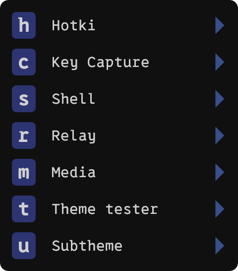
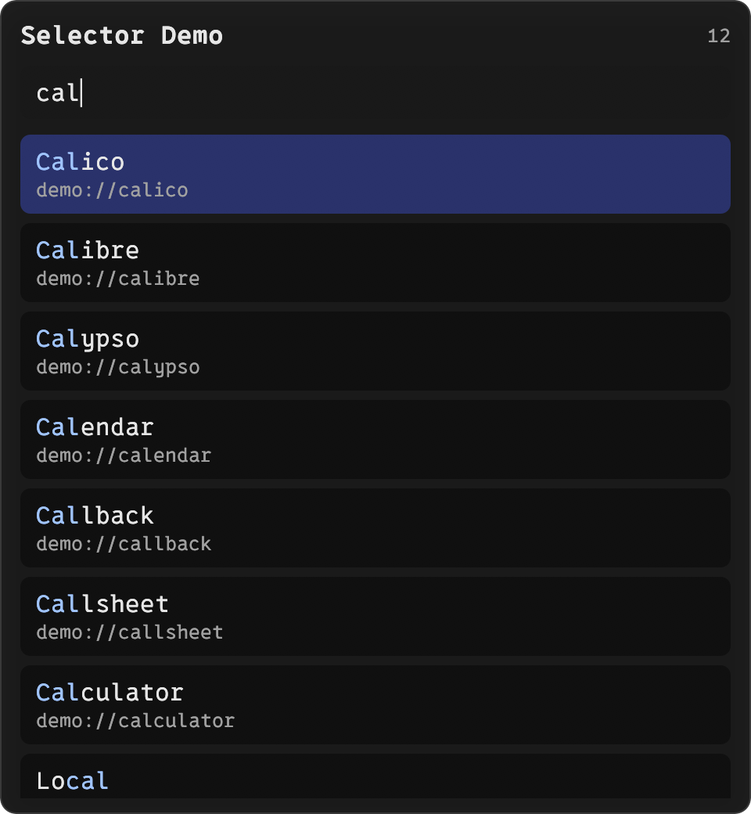
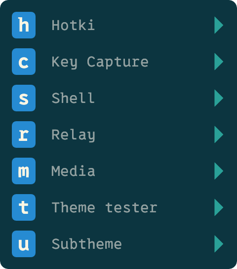
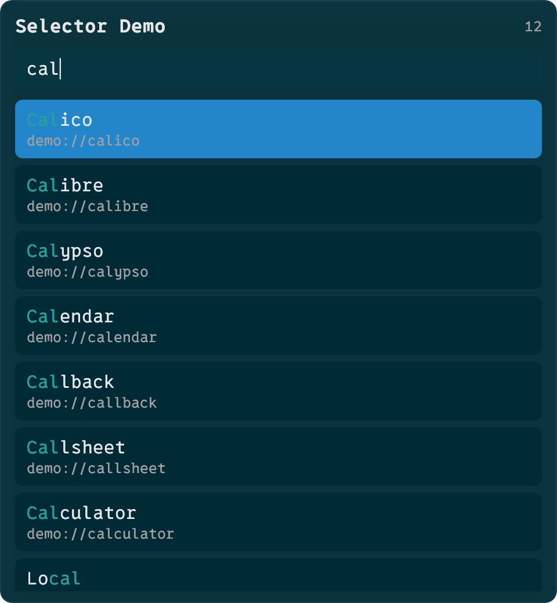
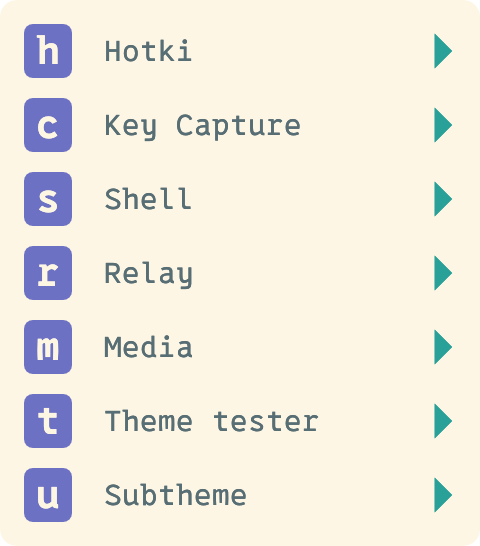
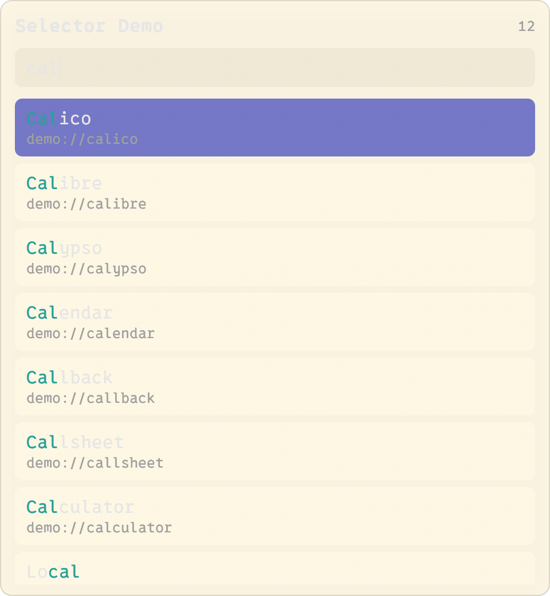
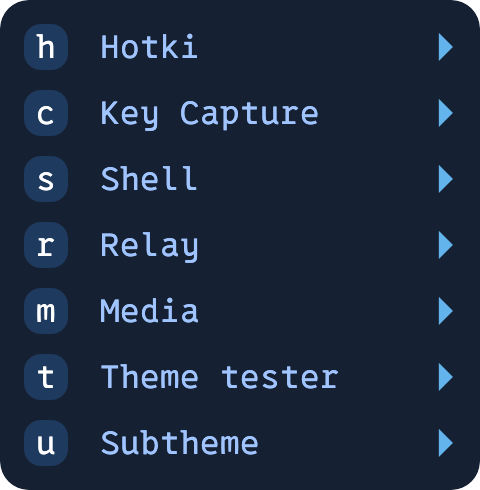
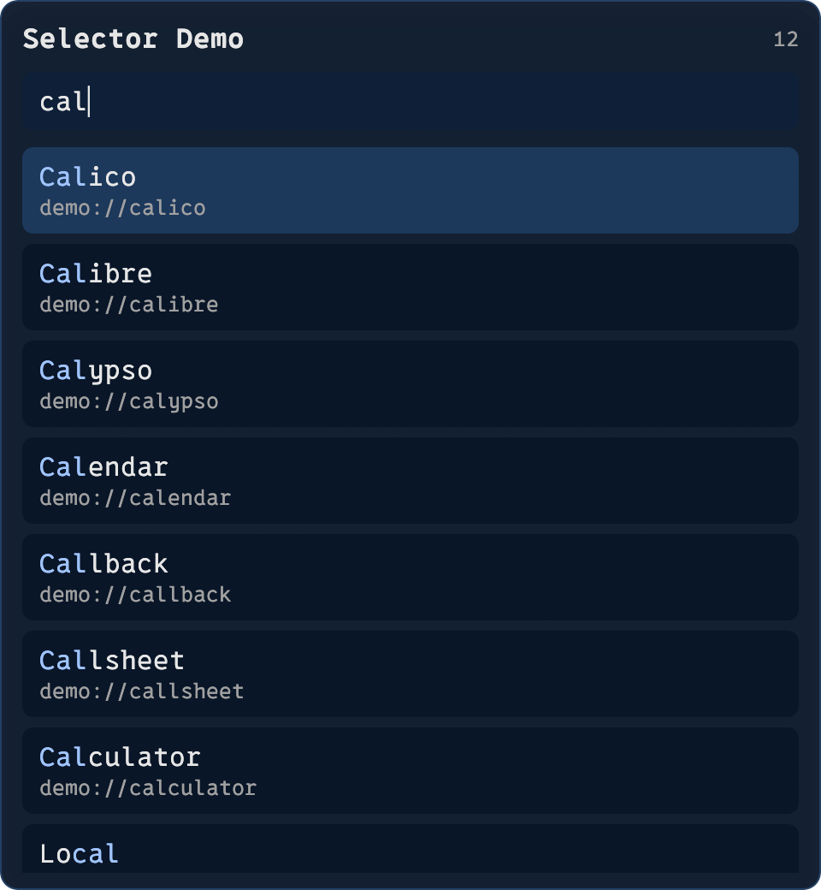
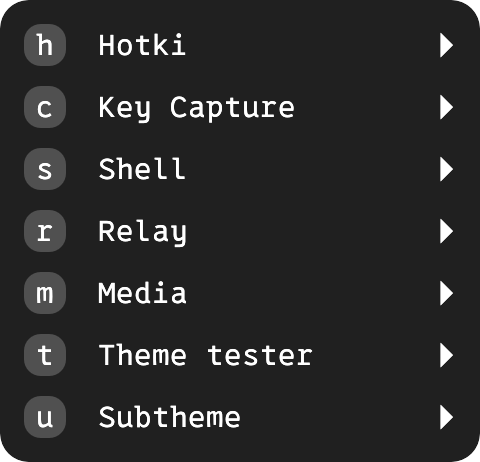
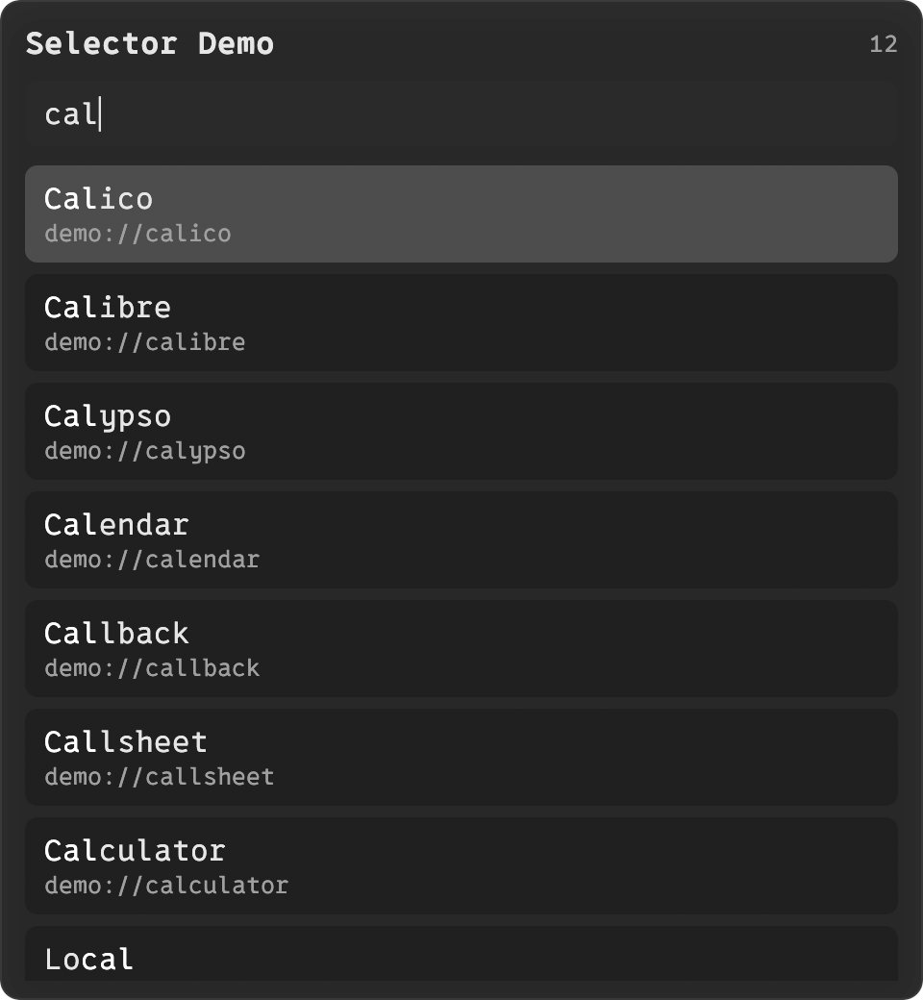

# Themes

This is a screenshot gallery of all built-in Hotki themes.

Theme names match `themes/*.rhai` file stems (e.g. `themes/solarized-dark.rhai` → `solarized-dark`).

## default

<table>
  <tr>
    <td>
      
    </td>
    <td>
      
      
       
      
      
       
      
    </td>
  </tr>
</table>

## solarized-dark

<table>
  <tr>
    <td>
      
    </td>
    <td>
      
      
       
      
      
       
      
    </td>
  </tr>
</table>

## solarized-light

<table>
  <tr>
    <td>
      
    </td>
    <td>
      
      
       
      
      
       
      
    </td>
  </tr>
</table>

## dark-blue

<table>
  <tr>
    <td>
      
    </td>
    <td>
      
      
       
      
      
       
      
    </td>
  </tr>
</table>

## charcoal

<table>
  <tr>
    <td>
      
    </td>
    <td>
      
      
       
      
      
       
      
    </td>
  </tr>
</table>

